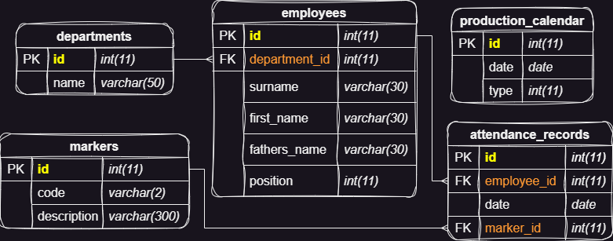

<p align="center">
    <br>
    <h3 align ="center"><b>Схема спроектированной базы данных MySQL</b></h3>
</p>

# **Cущности**

## **Таблица: departments**
|Тип ограничения|	Название поля|	Тип поля|	Описание|
|:--:|---|---|---|
|Primary Key|	id|	int(11)|	Уникальный идентификатор департамента.|
|-|name|	varchar(50)|	Название департамента.|

## **Таблица: employees**
|Тип ограничения|	Название поля|	Тип поля|	Описание|
|:--:|---|---|---|
| Primary Key| id| int(11)|	Уникальный идентификатор сотрудника.|
| Foreign Key|	department_id|	int(11)|	Ссылается на departments.id. Идентификатор соответствующего департамента сотрудника.|
|-|surname|	varchar(30)|	Фамилия сотрудника.|
|-|first_name|	varchar(30)|	Имя сотрудника.|
|-|fathers_name|	varchar(30)|	Отчество сотрудника.|
|-|position|	int(11)|	Должность сотрудника. Представлено в виде перечисляемого значения в коде программы.|

## **Таблица: production_calendar**
|Тип ограничения|	Название поля|	Тип поля|	Описание|
|:--:|---|---|---|
|Primary Key|	id|	int(11)|	Уникальный идентификатор записи в производственном календаре.|
|-|date|	date|	Специфическая дата производственного календаря.|
|-|type|	int(11)|	Тип дня для записи в производственном календаре. Представлено в виде перечисляемого значения в коде программы.|

## **Таблица: attendance_records**
|Тип ограничения|	Название поля|	Тип поля|	Описание|
|:--:|---|---|---|
|Primary Key|	id|	int(11)|	Уникальный идентификатор записи о посещаемости.|
|Foreign Key|	employee_id|	int(11)|	Ссылается на employees.id. Идентификатор соответствующего сотрудника для записи о посещаемости.|
|-|date|	date|	Специфическая дата записи о посещаемости.|
|Foreign Key|	marker_id|	int(11)|	Ссылается на markers.id. Идентификатор соответствующей отметки для записи о посещаемости.|

# **Связи**
|Название таблицы|	Ключ|	Связь|	Ссылка на поле|	Ссылка на таблицу|
| --- | --- | --- | --- | --- |
|departments|	id|	Один ко многим|	employees.department_id|	departments.id|
|employees|	id|	Один ко многим|	attendance_records.employee_id|	employees.id|
|markers|	id|	Один ко многим|	attendance_records.marker_id|	markers.id|

# **Средства используемы для разработки**
**ОС**: *Windows 10/11*  
**IDE**: *Miscrosoft Visual Studio 2022*  
**Язык программирования:** *C#*  
**.NET:** *6.0*   
**Framework:** *Windows Forms (Майкрософт)*  
**СУБД**: *10.4.28-MariaDB*  
**Локальный Web-сервер:** *XAMPP 8.2.4 / PHP 8.2.4*

# **Файл конфигураций**
**В корневой директории с исполняемым файлом программы находится конфигурационный файл `timesheet.toml`, в котором настройки подключения к базе данных; открывается любым текстовым редактором _(Блокнот / VS Code / Notepad++)_.**  
**По умолчанию файл содержит следующий формат:**
```
# Это комментарий, который будет проигнорирован

[DataBase]
Host = "localhost" # адрес
Username = "TimeSheet" # имя пользователя
Password = "12345" # пароль
DataBaseName = "timesheet" # название БД
```
# Запуск и управление программой
1. **В корневой директории репозитория скачайте и разархивируйте файл `timesheet-release-2023-1.zip`;**
1. **Импортируйте файл с БД `.\timesheet.sql` из корневой директории архива на ваш MySQL сервер;**
2. **В корневой директории с исполняемым файлом `TimeSheet\TimeSheet.exe` в конфигурационном файле `TimeSheet\timesheet.toml` настройте параметры подключения к БД и сохраните;**
3. **Дважды нажмите ЛКМ наведя курсор на исполняемомый файл `TimeSheet\TimeSheet.exe` для открытия приложения;**
4. **При успешном подключении к БД будет считан список департаментов и выведен в левую коронку. Для выбора департамента наведите курсор мыши на один из пунктов и сделайте выбор двойным нажатием ЛКМ;**
5. **При выборе департамента в левой части приложения откроется таблица со списком сотрудников и информацией об их посещаемости по месяцам года;**  
6. **Для переключения между месяцами наведите курсор на одну из 12-ти вкладок и единожды нажмите ЛКМ.**
